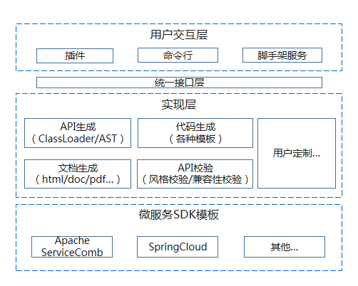
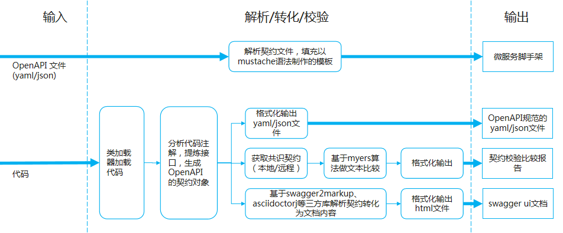

# Toolkit | [English](./README.md) [](https://travis-ci.org/apache/servicecomb-toolkit?branch=master)[](https://coveralls.io/github/apache/servicecomb-toolkit?branch=master)[](https://www.apache.org/licenses/LICENSE-2.0.html) [](https://gitter.im/ServiceCombUsers/Lobby)

Apache ServiceComb Toolkit 是基于契约的微服务开发工具套件

## 1 简介

### 1.1 目标

* 提供契约、代码、文档相互转换及校验的能力，帮助用户一键式快速构建基于流行微服务框架和流行编程模型的微服务工程，降低微服务入门成本，使用户聚焦业务开发，提升遗留系统重构、开发效率。


### 1.2 特性

* 遗留应用提取契约文件

  在基于SpringMVC/POJO/JAX-RS模型开发的应用中，一键提取符合OpenAPI规范的服务契约文件。

* 契约文件生成微服务工程

  输入符合OpenAPI规范的服务契约，一键生成以ServiceComb/SpringCloud/Swagger为底座，以及以SpringMVC/POJO/JAX-RS或SpringBoot为开发模型的微服务项目。

* 契约与代码一致性校验

  校验应用的实际实现（如数据和服务API）是否与样本服务契约描述一致。

* 契约/代码生成文档

  输入符合OpenAPI规范的服务契约，一键生成html格式的文档。

* Todo List

  * 支持一键生成以SpringCloud为底座的微服务工程。

  * 支持一键从遗留应用代码生成微服务工程。

  * 支持基于gradle的契约开发插件。

  * 支持插件埋入eclipse。

  * 支持word、pdf等流行格式文档。

  * 支持契约增量生成代码。

  * 工具能力服务化。

### 1.3 适用场景

* 集成多厂商应用的企业

  问题：厂商数据、服务标准不一致，开发语言、习惯、框架不一致，集成商难集成，企业难管控。

  措施：通过统一定义的接口描述标准（服务契约），使用工具套件一键生成基于指定微服务框架的微服务工程，并且通过服务契约校验手段协同维护整体系统的一致性。以此协调多个开发团队，降低沟通成本且避免后期的混乱。

* 遗留系统微服务化快速改造

  问题：用户需要额外学习和理解微服务及相关框架后，再设计微服务工程，学习成本高。

  措施：使用工具套件分析遗留应用提取服务契约，再一键生成基于指定微服务框架的微服务工程后，即可聚焦业务开发，减少用户对微服务框架的学习成本。

## 2 设计

### 2.1 主体架构



### 2.2 工作原理



## 3 快速入门
### 3.1 从源码构建工具和插件
构建环境要求:

* [Java 8](http://java.oracle.com)

* [Apache maven 3.5.0 or greater](http://maven.apache.org/)

```shell
# 从github获取toolkit最新源码
$ git clone https://github.com/apache/servicecomb-toolkit.git
$ cd toolkit

# 构建打包
$ mvn clean install
```


### 3.2 使用toolkit-maven-plugin插件
#### 3.2.1 配置
在maven项目的pom文件中配置
```xml
<plugin>
    <groupId>org.apache.servicecomb.toolkit</groupId>
    <artifactId>toolkit-maven-plugin</artifactId>
    <version>0.1.0-SNAPSHOT</version>
    <configuration>
        <!-- 输入源。设置为 code，表示解析当前代码；设置为 contract，表示解析指定目录的契约文件。不设置则默认为 code -->
        <sourceType>code</sourceType>
        <!-- 生成契约文件的类型，不设置则默认为 yaml -->
        <contractFileType>yaml</contractFileType>
        <!-- 生成文档的类型，不设置则默认为 html -->
        <documentType>html</documentType>
        <!-- 生成契约文件、文档的根目录，不设置则默认为运行命令所在目录下的 target 目录，生成的微服务工程在 project 目录，契约文件在 contract 目录，文档在 document 目录 -->
        <outputDirectory>./target</outputDirectory>
        <!-- 被解析的契约文件路径，在 sourceType 设置为 contract 时有效，且必须设置 -->
        <contractLocation>./contract</contractLocation>
        <!-- 被校验的契约文件目录，在 sourceType 设置为 contract 时有效，且必须设置 -->
        <sourceContractPath>./target/contract</sourceContractPath>
        <!-- 样本契约文件目录，必须设置 -->
        <destinationContractPath>./contract</destinationContractPath>
        <!-- 生成的微服务代码工程配置 -->
        <service>
            <!-- 微服务的类型，可生成 provider/consumer/all，默认值为 all -->
            <serviceType>all</serviceType>
            <!-- 微服务的 groupid，用户可选，默认值为 domain.orgnization.project -->
            <groupId>domain.orgnization.project</groupId>
            <!-- 微服务的 artifactId，用户可选，默认值为 sample -->
            <artifactId>sample</artifactId>
            <!-- 微服务的 artifactVersion，用户可选，默认值为 0.1.0-SNAPSHOT -->
            <artifactVersion>0.1.0-SNAPSHOT</artifactVersion>
            <!-- 微服务的 packageName，用户可选，默认值为 domain.orgnization.project.sample -->
            <packageName>domain.orgnization.project.sample</packageName>
        </service>
    </configuration>
</plugin>
```

#### 3.2.2 命令
```shell
# 生成契约，文档和微服务工程
mvn toolkit:generate

# 校验代码和契约一致性
mvn toolkit:verify
```

#### 3.2.2.1 解析代码，生成微服务代码工程、OpenAPI规范契约、文档

配置项(不显式设置 `<configuration>` 则使用默认配置)
例：
```xml
<plugin>
    <groupId>org.apache.servicecomb.toolkit</groupId>
    <artifactId>toolkit-maven-plugin</artifactId>
    <version>0.1.0-SNAPSHOT</version>
    <configuration>
        <!-- 输入源。设置为 code，表示解析当前代码；设置为 contract，表示解析指定目录的契约文件。不设置则默认为 code -->
        <sourceType>code</sourceType>
        <!-- 生成契约文件、文档的根目录，不设置则默认为运行命令所在目录下的 target 目录，生成的微服务工程在 project 目录，契约文件在 contract 目录，文档在 document 目录 -->
        <outputDirectory>./target</outputDirectory>
        <!-- 生成的微服务代码工程配置 -->
        <service>
            <!-- 微服务的类型，可生成 provider/consumer/all，默认值为 all -->
            <serviceType>all</serviceType>
        </service>
    </configuration>
</plugin>
```

运行命令
```shell
mvn toolkit:generate
```

#### 3.2.2.2 解析契约，生成微服务工程、文档

配置项(不显式设置 `<configuration>` 则使用默认配置)
例：
```xml
<plugin>
    <groupId>org.apache.servicecomb.toolkit</groupId>
    <artifactId>toolkit-maven-plugin</artifactId>
    <version>0.1.0-SNAPSHOT</version>
    <configuration>
        <!-- 输入源。设置为 code，表示解析当前代码；设置为 contract，表示解析指定目录的契约文件。不设置则默认为 code -->
        <sourceType>contract</sourceType>
        <!-- 被解析的契约文件路径，在 sourceType 设置为 contract 时有效，且必须设置 -->
        <contractLocation>./contract</contractLocation>
        <!-- 生成契约文件、文档的根目录，不设置则默认为运行命令所在目录下的 target 目录，生成的微服务工程在 project 目录，契约文件在 contract 目录，文档在 document 目录 -->
        <outputDirectory>./target</outputDirectory>
        <!-- 生成的微服务代码工程配置 -->
        <service>
            <!-- 微服务的类型，可生成 provider/consumer/all，默认值为 all -->
            <serviceType>provider</serviceType>
        </service>
    </configuration>
</plugin>
```

运行命令
```shell
mvn toolkit:generate
```

#### 3.2.2.3 代码和契约一致性校验

配置项
例：
```xml
<plugin>
    <groupId>org.apache.servicecomb.toolkit</groupId>
    <artifactId>toolkit-maven-plugin</artifactId>
    <version>0.1.0-SNAPSHOT</version>
    <configuration>
        <!-- 输入源。设置为 code，表示解析当前代码；设置为 contract，表示解析指定目录的契约文件。不设置则默认为 code -->
        <sourceType>code</sourceType>
        <!-- 样本契约文件目录，必须设置 -->
        <destinationContractPath>./contract</destinationContractPath>
    </configuration>
</plugin>
```

运行命令
```shell
mvn toolkit:verify
```


### 3.3 使用toolkit cli工具
可执行jar包位于toolkit/cli/target/bin目录下
```shell
$ java -jar toolkit-cli-{version}.jar help
```
#### 3.3.1 契约生成微服务工程
```shell
$ java -jar toolkit-cli-{version}.jar  codegenerate -m ServiceComb -i swagger.yaml -o ./project -p SpringMVC
```
> **codegenerate** 命令选项说明:
* -m, --microservice-framework : 指定微服务框架,现支持ServiceComb  
例：-m ServiceComb
* -p, --programming-model : 指定编程模型，可选JAX-RS，POJO，SpringMVC，SpringBoot  
例：-p SpringMvc
* -i, --input : 指定遵循OpenAPI规范的契约文件，支持yaml和json格式，支持指定本地和网络文件  
例：-i http://petstore.swagger.io/v2/swagger.json
* -o, --output : 生成的项目代码输出路径  
例：-o ./project
* --group-id : 指定生成的项目的group id  
例：--group-id com.demo
* --artifact-id : 指定生成的项目的artifact id     
例：--artifact-id springmvc-example
* --artifact-version : 指定生成的项目的artifact version  
例：--artifact-version 1.0.0
* --api-package : 指定生成项目的api package  
例：--api-package com.demo.api
* --model-package : 指定生成项目的model package   
例：--model-package com.demo.model
* -t, --service-type : 指定生成的微服务项目的微服务类型。可选值为provider,consumer,all                  
例：--service-type provider  

#### 3.3.2 契约生成文档
```shell
$ java -jar toolkit-cli-{version}.jar docgenerate -i swagger.yaml -o ./document
```
> **docgenerate** 命令选项说明:
* -i, --input : 指定遵循OpenAPI规范的契约文件，支持yaml和json格式，支持指定本地和网络文件  
例：-i http://petstore.swagger.io/v2/swagger.json
* -o, --output : 文档输出路径   
例：-o ./document
* -f, --format : 指定输出文档风格,现支持swagger-ui
例：-f swagger-ui


## 4 社区互动

* [提交issues](https://issues.apache.org/jira/browse/SCB)
* [gitter聊天室](https://gitter.im/ServiceCombUsers/Lobby)
* 邮件列表: [订阅](mailto:dev-subscribe@servicecomb.apache.org) [浏览](https://lists.apache.org/list.html?dev@servicecomb.apache.org)

## 5 参与开发

See [Pull Request Guide](http://servicecomb.apache.org/developers/submit-codes/) for details.
