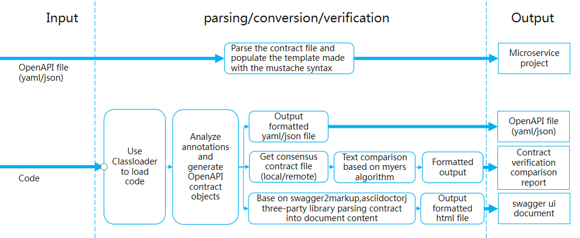

# toolkit

Contract-based microservice development toolkit

[中文简介](./README-ZH.md)

## 1 Introduction

### 1.1 Conceptions

* A contract-based microservice development toolkit with the goal of rapidly building microservices projects based on popular microservices frameworks and programming models, and supporting the automatic generation of contracts,code and documentation to help users reduce micro-service entry costs, focus on business development, and improve legacy system reconfiguration and development efficiency during the microservice transformation phase.

### 1.2 Features

* Code extraction service contract

  In applications developed based on the SpringMVC/POJO/JAX-RS model, one-click generation of service contract files conforming to the OpenAPI specification.

* Service contract generation microservice project

  Enter a service contract that conforms to the OpenAPI specification, one-click generation of a microservice project with ServiceComb/SpringCloud/Swagger as the base microservice framework and SpringMVC/POJO/JAX-RS or SpringBoot as programming model.

* Service contract and code consistency check

  Verify that the actual implementation of the application (such as the data and service API) is consistent with the agreed service contract description.

* Service contract/code generation document

  Enter a service contract that conforms to the OpenAPI specification, one-click generation of a document in html/word/pdf format.

* Todo List

  * Support contract one-click production microservice engineering based on popular microservice framework such as SpringCloud.

  * Support gradle-based contract development plugin.

  * Support plugins to embed eclipse.

  * Support for generating popular format documents such as word, pdf.

  * Support contract incremental generation code.

  * Support for generating "Hello World" microservice demo project.

### 1.3 Applicable Scene

* For users who integrate multi-vendor applications

  Scene: the development languages, habits, and frameworks of different vendors are different, the entire system data and service standards are inconsistent, users are difficult to integrate, and it is difficult to manage and control the final delivery quality.

  Solution：Through a uniformly defined interface description standard (service contract), a toolkit is used to generate a microservice project based on a specified microservices framework, and the consistency of the whole system is coordinated through service contract verification. Coordinate multiple development teams to reduce communication costs and avoid post-chaos.

* For users who have evolved from legacy systems to microservices

  Scene: additional learning and understanding of the microservices-related framework details is required before the microservices project can be designed, built, and developed according to the selected microservices framework. For users, Need to be distracted to focus on things outside the business.

  Solution: Using the toolkit to analyze the legacy application extraction service contract, and then generate the microservices project based on the specified microservices framework, you can focus on business development and reduce the learning cost of the microservices framework.

## 2 Design

### 2.1 Architecture


### 2.2 Working Principle



## 3 Quick Start
### 3.1 Build tool and plugins from source

> Build environment requirements
* [Java 8](http://java.oracle.com)
* [Apache maven 3.5.0 or greater](http://maven.apache.org/)

```shell
# Get the latest source code for toolkit from github
$ git clone https://github.com/MabinGo/toolkit.git
$ cd toolkit

# Build package
$ mvn clean install
```

### 3.2 Use the toolkit cli
The executable jar package is located in the toolkit/cli/target/bin directory
```shell
$ java -jar toolkit-cli-{version}.jar help
```
#### 3.2.1 Service contract generation microservice project
```shell
$ java -jar toolkit-cli-{version}.jar  codegenerate -m ServiceComb -i swagger.yaml -o ./project -p SpringMVC
```
> **codegenerate** Command option
* -m, --microservice-framework. Specify microservices framework, now supports ServiceComb.  
e.g.：-m ServiceComb
* -p, --programming-model. Specify programming model, optional JAX-RS, POJO, SpringMVC, SpringBoot.  
e.g.：-p SpringMvc
* -i, --input. Specifies contract files that follow the OpenAPI specification, supports yaml and json formats, and supports specifying local and network files.  
e.g.：-i http://petstore.swagger.io/v2/swagger.json
* -o, --output. Generated project code output path.  
e.g.：-o ./project
* --group-id. Specify the group id of the generated project.  
e.g.：--group-id com.demo
* --artifact-id. Specify the artifact id of the generated project.  
e.g.：--artifact-id springmvc-example
* --artifact-version. Specify the artifact version of the generated project.   
e.g.：--artifact-version 1.0.0
* --api-package : Specify the api package of the generated project.   
e.g.：--api-package com.demo.api  
* --model-package : Specify the model package of the generated project.  
e.g.：--model-package com.demo.model
* -t, --service-type : Specify microservice type of generated microservice project. optional value is provider,consumer,all               
e.g.：--service-type provider  

#### 3.2.2 Service contract generation document
```shell
$ java -jar toolkit-cli-{version}.jar docgenerate -i swagger.yaml -o ./document
```
> **docgenerate** Command option
* -i, --input. Specifies contract files that follow the OpenAPI specification, supports yaml and json formats, and supports specifying local and network files.
例：-i http://petstore.swagger.io/v2/swagger.json
* -o, --output. Document output path.
例：-o ./document
* -f, --format. Specifies the output document format, now supports swagger-ui and asciidoc-html
例：-f swagger-ui

### 3.3 Use the toolkit-maven-plugin plugin
#### 3.3.1 configuration
Configured in the pom file of the maven project
```xml
<plugin>
    <groupId>org.apache.servicecomb</groupId>
    <artifactId>toolkit-maven-plugin</artifactId>
    <version>0.1.0-SNAPSHOT</version>
    <configuration>
        <!-- Contracts generation directory -->
        <outputDir>./contracts</outputDir>
        <!-- SourceContracts placement directory -->
        <sourceContractsDir>./sourceContracts</sourceContractsDir>  
        <!-- Document generation directory -->
        <docOutputDir>./documents</docOutputDir>
    </configuration>
</plugin>
```
#### 3.3.2 Extract the contract from the code

Run in shell
```shell
mvn toolkit:generateContracts
```

Configuration
* outputDir: contract generation directory
example
```xml
<outputDir>./contracts</outputDir>
```

#### 3.3.3 Generate documentation from code

Run in shell
```shell
mvn toolkit:generateDoc
```

Configuration
* outputDir : Contract generation directory
* docOutputDir : Generated contract document output path

example
```xml
<outputDir>./contracts</outputDir>
<docOutputDir>./documents</docOutputDir>
```

#### 3.3.4 Contract verify

Run in shell
```shell
mvn toolkit:verifyContracts
```

Configuration
* outputDir - The generated contract file output path.
* sourceContractsDir - Consensus contract storage path.
example
```xml
<outputDir>./contracts</outputDir>
<sourceContractsDir>./sourceContracts</sourceContractsDir>
```

## 4 Contact

Bugs: [issues](https://github.com/MabinGo/toolkit/issues)

## 5 Contribute

PR: [Pull request](https://github.com/MabinGo/toolkit/pulls)
