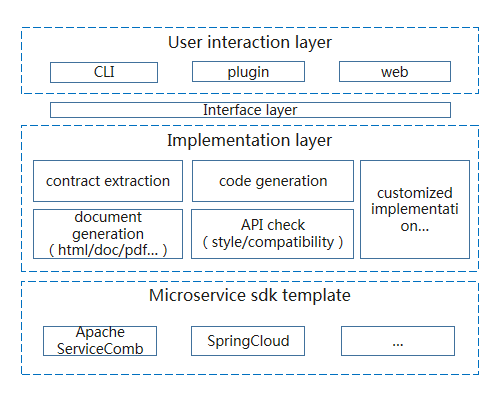

# Toolkit | [中文](./README-ZH.md) [](https://travis-ci.org/apache/servicecomb-toolkit?branch=master)[](https://coveralls.io/github/apache/servicecomb-toolkit?branch=master)[](https://www.apache.org/licenses/LICENSE-2.0.html)[](https://sonarcloud.io/dashboard?id=servicecomb-toolkit) [](https://gitter.im/ServiceCombUsers/Lobby)

Apache ServiceComb Toolkit is a contract-based microservice development toolkit

## 1 Introduction

### 1.1 Conceptions

* Provides the ability to convert and verify contracts, code, and documents, helping users quickly build microservice projects based on popular microservices frameworks and popular programming models, reducing the cost of microservices entry, enabling users to focus on business development, enhance refactoring and development efficiency.


### 1.2 Features

* Code extraction service contract

  In applications developed based on the SpringMVC/POJO/JAX-RS model, one-click generation of service contract files conforming to the OpenAPI specification.

* Service contract generation microservice project

  Enter a service contract that conforms to the OpenAPI specification, one-click generation of a microservice project with ServiceComb/SpringCloud/Swagger as the base microservice framework and SpringMVC/POJO/JAX-RS or SpringBoot as programming model.

* Service contract and code consistency check

  Verify that the actual implementation of the application (such as the data and service API) is consistent with the agreed service contract description.

* Service contract style checking and compatibility checking

  The style checking checks whether the contract conforms to [OAS 3.0.2 specification] [openapi-3.0.2] and custom rules; the compatibility checking checks whether new OAS spec compatible with old spec

* Service contract/code generation document

  Enter a service contract that conforms to the OpenAPI specification, one-click generation of a document in html format.

* Todo List
  
  * Support gradle plugin, eclipse plugin, intellij plugin.

  * Support for generating popular format documents such as word, pdf.

  * Support contract incremental generation code.

  * Make capability as a service.
  
  * Server-side automatic / semi-automatic test
  
  * Interface matching check
  
  * Support for generating microservice scaffolding containing code snippets that connect to common DBs such as Mysql / Redis

### 1.3 Applicable Scene

* For users who integrate multi-vendor applications

  Scene: the development languages, habits, and frameworks of different vendors are different, the entire system data and service standards are inconsistent, users are difficult to integrate, and it is difficult to manage and control the final delivery quality.

  Solution：Through a uniformly defined interface description standard (service contract), a toolkit is used to generate a microservice project based on a specified microservices framework, and the consistency of the whole system is coordinated through service contract verification. Coordinate multiple development teams to reduce communication costs and avoid post-chaos.

* For users who have evolved from legacy systems to microservices

  Scene: additional learning and understanding of the microservices-related framework details is required before the microservices project can be designed, built, and developed according to the selected microservices framework. For users, Need to be distracted to focus on things outside the business.

  Solution: Using the toolkit to analyze the legacy application extraction service contract, and then generate the microservices project based on the specified microservices framework, you can focus on business development and reduce the learning cost of the microservices framework.

## 2 Design

### 2.1 Architecture



### 2.2 Working Principle


## 3 Quick Start
### 3.1 Build tool and plugins from source

> Build environment requirements
* [Java 8](http://java.oracle.com)
* [Apache maven 3.5.0 or greater](http://maven.apache.org/)

```shell
# Get the latest source code for toolkit from github
$ git clone https://github.com/apache/servicecomb-toolkit.git
$ cd toolkit

# Build package
$ mvn clean install
```

### 3.2 Use the toolkit-maven-plugin plugin
#### 3.2.1 configuration
Configured in the pom file of the maven project
```xml
<plugin>
    <groupId>org.apache.servicecomb.toolkit</groupId>
    <artifactId>toolkit-maven-plugin</artifactId>
    <version>0.3.0-SNAPSHOT</version>
    <configuration>
        <!-- Set to 'code' to resolve the current project. Set to 'contract' to resolve the contract file for the specified path.If not set, the default is 'code' -->
        <sourceType>code</sourceType>
        <!-- The type of the contract file is generated. If it is not set, the default is 'yaml' -->
        <contractFileType>yaml</contractFileType>
        <!-- The type of the generated document. If not set, the default is 'html' -->
        <documentType>html</documentType>
        <!-- The root directory to save microservice project,contract file and document. If it is not set, the default is the 'target' under the directory where the command is run -->
        <outputDirectory>./target</outputDirectory>
        <!-- Input contract file path. Valid when sourceType is set to 'contract', must be set -->
        <contractLocation>./contract</contractLocation>
        <!-- Checked contract file path. Valid when sourceType is set to 'contract', must be set -->
        <sourceContractPath>./target/contract</sourceContractPath>
        <!-- Sample contract file path, must be set -->
        <destinationContractPath>./contract</destinationContractPath>
        <!-- Generated microservice project configuration -->
        <service>
            <!-- Microservice type,can generated 'provider/consumer/all',the default is 'all' -->
            <serviceType>all</serviceType>
            <!-- Microservice project 'groupid',optional,the default is 'domain.orgnization.project' -->
            <groupId>domain.orgnization.project</groupId>
            <!-- Microservice project 'artifactId',optional,the default is 'sample' -->
            <artifactId>sample</artifactId>
            <!-- Microservice project 'artifactVersion',optional,the default is '0.1.0-SNAPSHOT' -->
            <artifactVersion>0.1.0-SNAPSHOT</artifactVersion>
            <!-- Microservice project 'packageName',optional,the default is 'domain.orgnization.project.sample' -->
            <packageName>domain.orgnization.project.sample</packageName>
        </service>
        <!-- Specify additional attribute values that can be referenced by the mustache template.Only used when plugin goal is generate -->
        <additionalProperties>
            <prop1>value</prop1>
            <prop2>value</prop2>
            ...
            <propN>value</propN>
        </additionalProperties>
    </configuration>
</plugin>
```

#### 3.2.2 Command
```shell
# Generating contract, document and microservice project
mvn toolkit:generate

# Verify code and contract consistency
mvn toolkit:verify
```

#### 3.2.2.1 Extract the microservice project, OpenAPI contract file and document from the code

Configuration(use default configuration if not set `<configuration>`)

example
```xml
<plugin>
    <groupId>org.apache.servicecomb.toolkit</groupId>
    <artifactId>toolkit-maven-plugin</artifactId>
    <version>0.3.0-SNAPSHOT</version>
    <configuration>
        <!-- Set to 'code' to resolve the current project. Set to 'contract' to resolve the contract file for the specified path.If not set, the default is 'code' -->
        <sourceType>code</sourceType>
        <!-- The root directory to save contract file and document. If it is not set, the default is the 'target' under the directory where the command is run -->
        <outputDirectory>./target</outputDirectory>
        <!-- Generated microservice project configuration -->
        <service>
            <!-- Microservice type,can generated 'provider/consumer/all',the default is 'all' -->
            <serviceType>all</serviceType>
        </service>
    </configuration>
</plugin>
```

Run in shell
```shell
mvn toolkit:generate
```

When generating contracts from code,support for identifying restful interfaces written by the following annotations (class level)
>RestController, RestSchema, RpcSchema, RequestMapping

When generating contracts from code,the restful interface method access modifier must be specified as public


#### 3.2.2.2 Generate the microservice project and document from contract

Configuration(use default configuration if not set `<configuration>`)

example
```xml
<plugin>
    <groupId>org.apache.servicecomb.toolkit</groupId>
    <artifactId>toolkit-maven-plugin</artifactId>
    <version>0.3.0-SNAPSHOT</version>
    <configuration>
        <!-- Set to 'code' to resolve the current project. Set to 'contract' to resolve the contract file for the specified path.If not set, the default is 'code' -->
        <sourceType>contract</sourceType>
        <!-- The root directory to save contract file and document. If it is not set, the default is the 'target' under the directory where the command is run -->
        <outputDirectory>./target</outputDirectory>
        <!-- Input contract file path. Valid when sourceType is set to 'contract', must be set -->
        <contractLocation>./contract</contractLocation>
        <!-- Generated microservice project configuration -->
        <service>
            <!-- Microservice type,can generated 'provider/consumer/all',the default is 'all' -->
            <serviceType>provider</serviceType>
        </service>
    </configuration>
</plugin>
```

Run in shell
```shell
mvn toolkit:generate
```

#### 3.2.2.3 Contract verify

Configuration

example
```xml
<plugin>
    <groupId>org.apache.servicecomb.toolkit</groupId>
    <artifactId>toolkit-maven-plugin</artifactId>
    <version>0.3.0-SNAPSHOT</version>
    <configuration>
        <!-- Set to 'code' to resolve the current project. Set to 'contract' to resolve the contract file for the specified path.If not set, the default is 'code' -->
        <sourceType>code</sourceType>
        <!-- Sample contract file path, must be set -->
        <destinationContractPath>./contract</destinationContractPath>
    </configuration>
</plugin>
```

Run in shell
```shell
mvn toolkit:verify
```


### 3.3 Use the toolkit cli
* If you are using the official release version ( >=0.2.0 ), you can use the script files directly after decompressing the binary package
  * In Linux and Mac environment, please use cli.sh
  * In the Windows environment, please use cli.cmd
* If you are building from source, you can put `cli/scripts/cli.*` in the same directory as`cli/target/bin/toolkit-cli-{version}.jar` and then choose different scripts according to different environments

All the examples below are introduced through cli.sh for Linux environment
```shell
$ ./cli.sh help
```
#### 3.3.1 Service contract generation microservice project
```shell
$ ./cli.sh codegenerate -m ServiceComb -i swagger.yaml -o ./project -p SpringMVC
```
> **codegenerate** Command option
* -m, --microservice-framework. Specify microservices framework, now supports ServiceComb.  
e.g.：-m ServiceComb
* -p, --programming-model. Specify programming model, optional JAX-RS, POJO, SpringMVC, SpringBoot.  
e.g.：-p SpringMvc
* -i, --input. Specifies contract files that follow the OpenAPI specification, supports yaml and json formats, and supports specifying local and network files.  
e.g.：-i http://petstore.swagger.io/v2/swagger.json
* -o, --output. Generated project code output path.  
e.g.：-o ./project
* --group-id. Specify the group id of the generated project.  
e.g.：--group-id com.demo
* --artifact-id. Specify the artifact id of the generated project.  
e.g.：--artifact-id springmvc-example
* --artifact-version. Specify the artifact version of the generated project.   
e.g.：--artifact-version 1.0.0
* --api-package : Specify the api package of the generated project.   
e.g.：--api-package com.demo.api  
* --model-package : Specify the model package of the generated project.  
e.g.：--model-package com.demo.model
* -t, --service-type : Specify microservice type of generated microservice project. optional value is provider,consumer,all               
e.g.：--service-type provider  
* --properties : Specify additional attribute values that can be referenced by the mustache template
e.g.：--properties applicationId=app,providerServiceId=provider 

#### 3.3.2 Service contract generation document
```shell
$ ./cli.sh docgenerate -i swagger.yaml -o ./document
```
> **docgenerate** Command option
* -i, --input. Specifies contract files that follow the OpenAPI specification, supports yaml and json formats, and supports specifying local and network files.
e.g：-i http://petstore.swagger.io/v2/swagger.json
* -o, --output. Document output path.
e.g：-o ./document
* -f, --format. Specifies the output document format, now supports swagger-ui
e.g：-f swagger-ui

#### 3.3.3 Service contract style checking

```shell
$ ./cli.sh checkstyle -r style-check-rules.yaml -f oas.yaml
or
$ ./cli.sh cs -r style-check-rules.yaml -f oas.yaml
```

> **checkstyle** Command argument
* -r, --rules-file. Rules properties file.
* -f, --file. OpenAPI v3 spec yaml.

See [style check rules](oas-validator/README.md)

#### 3.3.4 Service contract compatibility checking

```shell
$ ./cli.sh checkcompatibility left-oas.yaml right-oas.yaml
or
$ ./cli.sh cc left-oas.yaml right-oas.yaml
```

> **checkcompatibility** Command argument
* &lt;files&gt; Two OpenAPI v3 spec yaml file

See [compatibilty check rules](oas-validator/README.md)


### 3.4 Use case

some example of using plugin can be found [here](./samples)

## 4 Contact us

* [issues](https://issues.apache.org/jira/browse/SCB)
* [gitter](https://gitter.im/ServiceCombUsers/Lobby)
* mailing list: [subscribe](mailto:dev-subscribe@servicecomb.apache.org) [view](https://lists.apache.org/list.html?dev@servicecomb.apache.org)

## 5 Contribute

PR: [Pull request](https://github.com/apache/servicecomb-toolkit/pulls)
