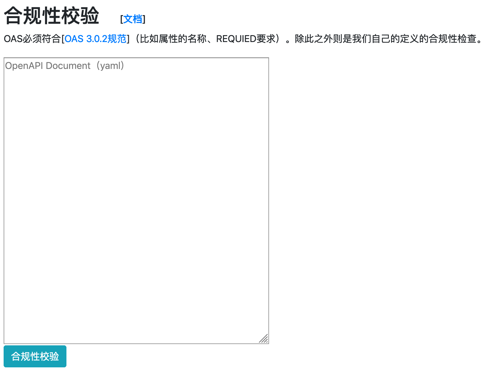
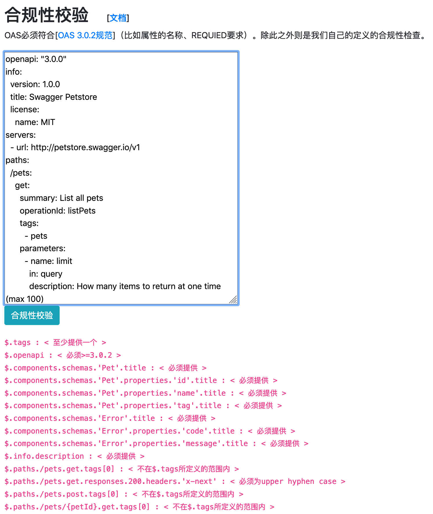
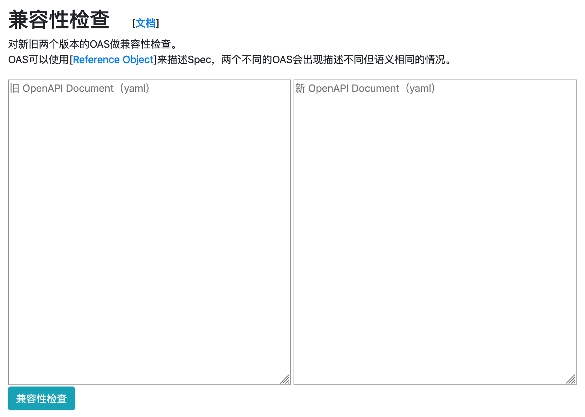
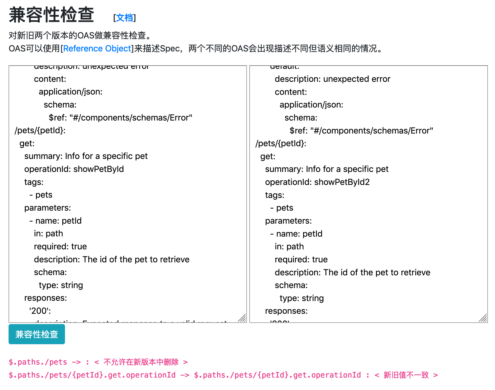

# 使用手册

## 访问

访问地址：[http://localhost:8080/](http://localhost:8080/)

## 工具

### 查看器

敬请期待……

### 编辑器

敬请期待……

### 验证器

分为 **风格校验** 和 **兼容性检查**

#### 风格校验

对 OpenAPI Spec 文档进行规范验证，对违反规范的错误作出提示。

##### 操作示例

1. Step 1

   

2. Step 2

   

#### 兼容性检查

对新旧两个 OpenAPI Spec 文档进行兼容性比较，检查出文档更新过程中出现的无法向下兼容的错误

##### 操作示例

1. Step 1

   

2. Step 2

   

